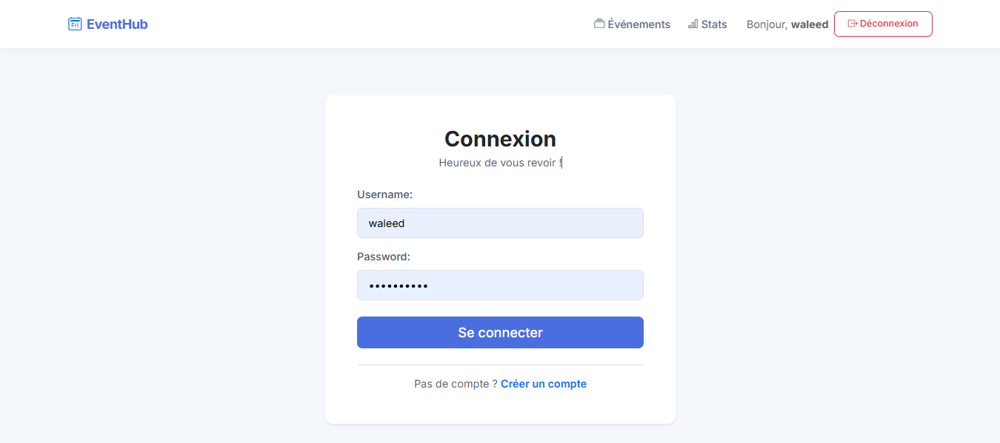
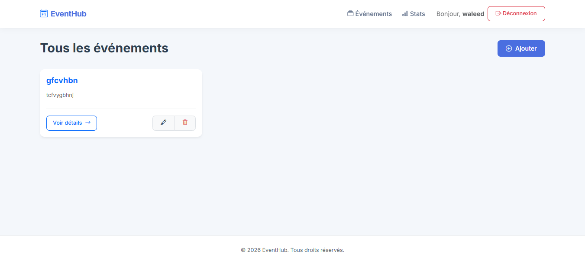
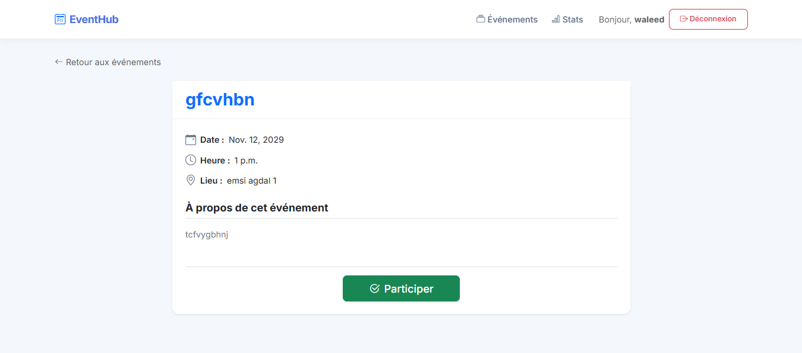
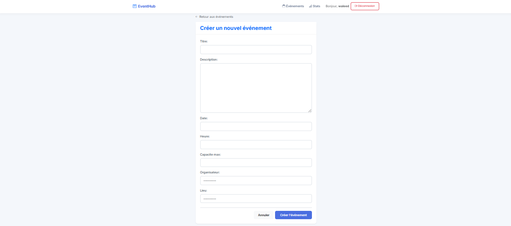
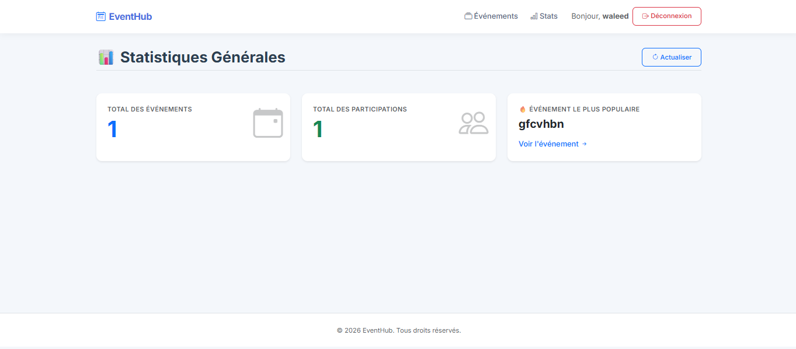

# 🎉 Event Management Web App


---

## 📌 Description

A web application built with Django to manage events, participants, and registrations.

---

## 🚀 Features

### 👤 Authentication

* Register
* Login / Logout

### 📅 Events

* Create / Update / Delete events
* View event list
* View event details

### 🙋 Participation

* Join event
* Cancel participation
* View participants

### 📍 Locations

* Assign location to events

---

## 🖼️ Screenshots

### Login


### Event List


### Event Detail


### Add Event


### Stats


## 🛠️ Tech Stack

* Python
* Django
* HTML / CSS
* SQLite

---

## ⚙️ Installation

```bash
python -m venv env
env\Scripts\activate
pip install -r requirements.txt
python manage.py migrate
python manage.py createsuperuser
python manage.py runserver
```

---

## 🌐 Usage

Open your browser:

```
http://127.0.0.1:8000
```

---

## 🔑 Admin Panel

```
http://127.0.0.1:8000/admin
```

---

## ⚠️ Notes

* Do NOT include `env/`
* Run `migrate` before starting
* Create a user to access the app

---

## 👨‍💻 Author

**Mahrouk Walid Ibrahim** 🚀

---

## ⭐ Future Improvements

* Better UI (Bootstrap)
* Role management
* Notifications
* Statistics dashboard
